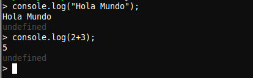

Tutorial de instalación de Node.js
==================================

Node.js® is a platform built on Chrome's JavaScript runtime for easily building fast, scalable network applications. Node.js uses an event-driven, non-blocking I/O model that makes it lightweight and efficient, perfect for data-intensive real-time applications that run across distributed devices.

## Ubuntu

### 1. Instalación

Para la instalación en *Ubuntu* introduciremos las siguientes líneas en la terminal:

> curl -sL https://deb.nodesource.com/setup | sudo bash -
>
> sudo apt-get install -y nodejs

### 2. Uso

Para empezar a usar *Node.js* escribiremos el siguiente comando en la terminal:

> nodejs

-
## Windows

### 1. Instalación

Para la instalación en *Windows* nos descargaremos el instalador directamente de la página [nodejs.org](http://nodejs.org).

### 2. Uso

Para empezar a usar *Node.js* abriremos la aplicación instalada con el mismo nombre, abriéndose así la consola.

-
## Primeros pasos

Para probar que todo ha ido bien probaremos lo siguiente:

> console.log("Hola Mundo");
>
> console.log(2+3);

La salida de estas líneas debería coincidir con la imagen adjunta.

